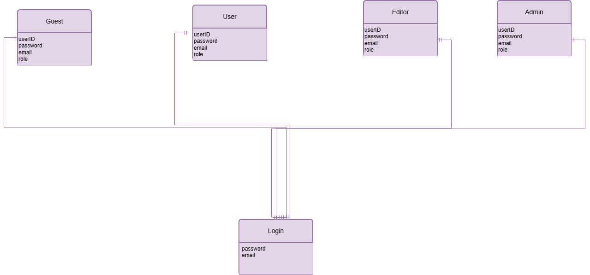
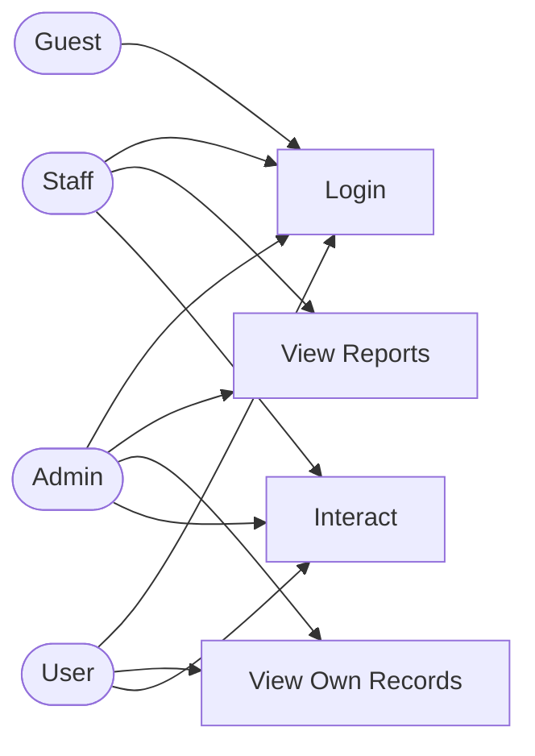

# Project Proposal: PHP + MySQL Application

> **Course:** J620-002-4:2020 Front-End Software Development (Level 4)
> **Competency Unit:** J620-002-4:2020-C01
> **Instructions:** Replace every `[ ... ]` and delete the hint lines (starting with `>`) before submitting. Keep this file as `README.md` in the root of your project repository.

---

## 1. Student Details

| Field | Your Answer |
|---|---|
| Candidate Name | Lee Zhi Han |
| NRIC Number | 080929-07-0183 |
| Date Submitted | 23/9/2026 |

---

## 2. Project Title

**Lexus The Financial Tracker**

### One-line summary
[ Describe what your application does in one sentence. ]
The application itself will be able to track down how much the user have spent through the whole month.
---

## 3. Problem Statement & Purpose

The application was able to solve money problem where people sometimes overspent it and regret it, this application was able to track down how much money they've spent. It is for everyone, and it's useful because it
will remind the user of how much money they have spent.

---

## 4. Tech Stack

| Layer | Technology |
|---|---|
| Markup | HTML5 |
| Styling | CSS3 |
| Server-side | PHP |
| Database | MySQL |

---

## 5. Types of Users (Roles)

| Role | Description |
|---|---|
| Admin  | The Admin are able to add, remove and edit the content, while also able to add/remove/edit the user. |
| Editor | The Editor can edit the content of the application. |
| User | The User not only able to view the application, but also able to interact with it, setting goals and track down their spending. |

### Role-Based Access Matrix

| Feature / Page | Admin | Editor | User | Guest (not logged in) |
|---|:---:|:---:|:---:|:---:|
| Register / Login | ✅ | ✅ | ✅ | ✅ |
|  Add/Remove/Edit Content & User  | ✅ | ❌ | ❌ | ❌ |
|  Edit Text/Img  | ✅ | ✅ | ❌ | ❌ |
|  Access Application | ✅ | ✅ | ✅ | ❌ |

---

## 6. Features

### 6.1 Core Features (must have)

- [ ] User registration and login
- [ ] Role-based access control (each role sees/does different things)
- [ ] Data management (Create, Read, Update, Delete)
- [ ] Track the current finiancal status
- [ ] Setting goals

### 6.2 Extra Features (nice to have)

- [ ] Change language (Malay,English,Mandarin)
- [ ] Change currency symbol

### 6.3 Feature Descriptions

| Feature | Description | Role(s) |
|---|---|---|
| Registration & Login | User may register for a brand new account or login into an account if they have one. | [User],[Editor],[Admin] |
| Role-based Access Control | The Editor or Admin have differece view from user, they get access to the control dashboard. | [Editor],[Admin] |
| Data Management | The Staff or Admin have the permission to either edit the content inside the application, or edit the user's data.  | [Editor], [Admin] | 
| Tracking Finiancal Status | What this does is that, the user or others roles can track their own finiancal status, tracking how much money they have spend. | [User], [Editor], [Admin] |
| Setting Goals | The user who use the application can set their own goal, how much money they want to save. | [User], [Editor], [Admin] |

--- 

## 7. Data Management System

| Data / Entity | Create | Read | Update | Delete |
|---|---|---|---|---|
|  Balance  | [User] [Editor] [User] | [User] [Editor] [User] | [User] [Editor] [User] | [User] [Editor] [User] |
| Goals | [User] [Editor] [Admin] | [User] [Editor] [User] | [User] [Editor] [User] | [User] [Editor] [User] |
|  User Data  | [Admin]  | [Admin] | [Admin] | [Admin] |
|  Content   | [Admin] | [Admin] [Editor] [User] | [Admin] [Editor] | [Admin] |

---

## 8. Database Design

### Entity Relationship Diagram (ERD)

---

## 9. Use Case Diagram

---

## 10. Presentation Checklist

- [ ] Can explain the purpose of the application
- [ ] Can justify design choices (why this database structure, why these roles)
- [ ] Can demo every role
- [ ] Can answer questions about my own code
- [ ] Submitted on time
